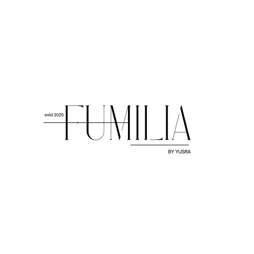

# Fumilia

**Fragrances Inspired by Meaningful Moments**

---

## About Fumilia

Fumilia is a fragrance and lifestyle brand created to turn memories, emotions, and meaningful moments into elegant scents.

The brand is inspired by family, connection, heritage, and the beauty of gifting something personal and memorable.

## Brand Logo

## Featured Product

---

## Brand Tagline

**Fragrances Inspired by Meaningful Moments**

---

## Featured Product

### Ghilaf-e-Kaaba Solid Perfume

A premium non-alcoholic solid perfume inspired by the beauty, memory, and spiritual feeling of the Kaaba.

---

## Product Features

- Non-Alcoholic
- Skin Nourishing
- Travel Friendly
- Lightweight
- Durable Packaging
- Gift Ready
- Premium Acrylic Cube Display

---

## Brand Values

- Meaningful Gifting
- Family Connection
- Elegance
- Heritage
- Spiritual Memories
- Premium Presentation

---

## Product Development

This repository documents the development of Fumilia, including:

- Logo Design
- Product Packaging
- Solid Perfume Concept
- Acrylic Cube Packaging
- Marketing Ideas
- Brand Storytelling
- Social Media Content

---

## Founder

**Hafiza Yusra Atique**

Organizational Psychology | HR | Digital Marketing | Entrepreneurship

---

## Connect

Email: yusraattique04@gmail.com  
GitHub: github.com/HafizaYusraAtique  
LinkedIn: www.linkedin.com/in/hafiza-yusra-atique-9719921b4
